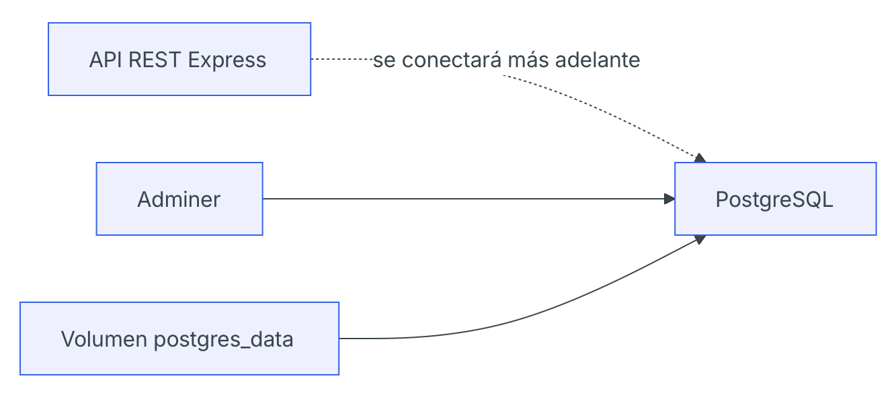

# Día 17 - PostgreSQL con Docker Compose

## Qué he hecho

- He comprobado que Docker está instalado.
- He creado un archivo `docker-compose.yml`.
- He levantado un servicio PostgreSQL.
- He levantado un servicio Adminer.
- He accedido a Adminer desde el navegador.
- He creado una tabla de prueba.
- He insertado un dato de prueba.
- He comprobado la persistencia usando un volumen.

## Servicios creados

| Servicio | Imagen         | Puerto | Función                                      |
| -------- | -------------- | ------ | -------------------------------------------- |
| postgres | postgres:16    | 5432   | Base de datos PostgreSQL                     |
| adminer  | adminer:latest | 8080   | Interfaz web para consultar la base de datos |

## Datos de conexión

| Campo         | Valor                |
| ------------- | -------------------- |
| Sistema       | PostgreSQL           |
| Servidor      | postgres             |
| Usuario       | usermanager          |
| Contraseña    | usermanager_password |
| Base de datos | usermanager_db       |

## Comandos usados

```bash
docker compose up -d
docker ps
docker compose ps
docker compose down
```

## Prueba de conexión

```sql
CREATE TABLE test_connection (
  id SERIAL PRIMARY KEY,
  message VARCHAR(100) NOT NULL
);

INSERT INTO test_connection (message)
VALUES ('PostgreSQL funciona correctamente');

SELECT * FROM test_connection;
```

## Explicación personal

Docker Compose permite levantar la base de datos y otras herramientas necesarias
usando un único archivo de configuración. Gracias al volumen, los datos de
PostgreSQL se conservan aunque paremos y volvamos a arrancar los contenedores.

## Explicación del docker-compose.yml

- services: Define los contenedores que formarán tu aplicación. Cada clave dentro de services es un servicio independiente (por ejemplo, web, db, redis). Es el bloque principal del archivo.
- image: Indica qué imagen de Docker se usará para crear el contenedor. Puede ser una imagen oficial (mysql:8.0) o una personalizada.
- container_name: Permite asignar un nombre fijo al contenedor, en lugar de dejar que Docker genere uno automáticamente. Útil para identificarlo fácilmente.
- environment:Lista de variables de entorno que se pasarán al contenedor. Sirven para configurar credenciales, puertos internos, modos de ejecución, etc.
- ports: Define el mapeo de puertos entre el host y el contenedor. Ejemplo: 8080:80 → el puerto 80 del contenedor se expone como 8080 en tu máquina.
- volumes: Permite montar directorios o archivos del host dentro del contenedor, o usar volúmenes persistentes. Sirve para guardar datos o compartir código.
- depends_on: Indica dependencias entre servicios: especifica qué contenedores deben iniciarse antes que otro. No garantiza que el servicio dependiente esté “listo”, solo que se inicia primero.

## Tabla de pruebas

Nombre de la tabla:
`notes`

Estructura de la tabla:
```sql
CREATE TABLE notes (
  id SERIAL PRIMARY KEY,
  title VARCHAR(100) NOT NULL,
  content TEXT NOT NULL
);
```

Inserción de valores:
```sql
INSERT INTO notes (title, content)
VALUES
('Primera nota', 'Estoy probando PostgreSQL'),
('Segunda nota', 'Los datos se guardan en un volumen');

SELECT * FROM notes;
```

Resultado:
|id | title	       | content                            |
| - | ------------ | ---------------------------------- |
| 1	| Primera nota | Estoy probando PostgreSQL          |
| 2	| Segunda nota | Los datos se guardan en un volumen |

## Borrado de volúmenes

- `docker compose down`: Detiene y elimina los contenedores, la red y el archivo de estado, pero NO borra los volúmenes declarados. Esto significa que los datos persisten y estarán disponibles cuando vuelvas a levantar los servicios.
- `docker compose down -v`: Hace todo lo anterior y además elimina los volúmenes asociados. Esto implica que se borran los datos almacenados en esos volúmenes (bases de datos, archivos persistentes, etc.).

## Diagrama de la arquitectura



- API REST Express: nuestra API (UserManager API)
- Adminer: interfaz web para consultar la base de datos
- Volumen postgres_data: almacena los datos que vayamos introduciendo en la base de datos en PostgreSQL
- PostgreSQL: base de datos relacional del proyecto

