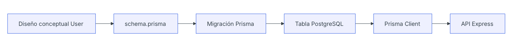

# Día 19 - ORM o acceso a datos

## Qué he hecho

- He entendido qué significa acceso a datos.
- He comparado SQL directo, Prisma, TypeORM y Sequelize.
- He aprendido qué es un ORM.
- He analizado ventajas e inconvenientes de cada opción.
- He relacionado el acceso a datos con el modelo User.
- He decidido usar Prisma como ORM principal del proyecto.

## Qué es el acceso a datos

El acceso a datos es la parte del backend encargada de leer y escribir información en la base de datos.

En este proyecto, la API necesitará acceder a PostgreSQL para crear, consultar, modificar y desactivar usuarios.

El flujo será:

Cliente HTTP → API Express → Capa de acceso a datos → PostgreSQL

## Comparación de opciones

| Opción      | Cómo se trabaja                           | Ventaja principal        | Inconveniente principal        |
| ----------- | ----------------------------------------- | ------------------------ | ------------------------------ |
| SQL directo | Escribiendo consultas SQL                 | Muy transparente         | Más código manual              |
| Prisma      | Modelos en schema.prisma y cliente tipado | Muy claro con TypeScript | Hay que aprender su ecosistema |
| TypeORM     | Clases, entidades y decoradores           | Orientado a objetos      | Más configuración inicial      |
| Sequelize   | Modelos ORM clásicos                      | Muy conocido en Node.js  | Menos natural con TS moderno   |

## SQL directo frente a Prisma

Ejemplo conceptual con SQL directo:

```ts
const result = await pool.query(
  "SELECT * FROM users WHERE id = $1",
  [id]
);
```

Ejemplo conceptual con Prisma:

```ts
const user = await prisma.user.findUnique({
  where: { id }
});
```

Ambos enfoques buscan un usuario por id, pero Prisma lo expresa desde el modelo User.

## Decisión técnica

Para este reto usaremos Prisma.

Motivos:

- Encaja muy bien con TypeScript.
- Permite definir modelos de forma clara.
- Genera un cliente tipado.
- Incluye migraciones.
- Incluye Prisma Studio.
- Reduce SQL repetitivo.
- Se integra bien con una arquitectura por capas.

SQL directo sigue siendo importante para entender qué ocurre por debajo, pero no será el camino principal del proyecto.

## Prisma dentro de la arquitectura

Más adelante, Prisma se usará desde la capa de repositorio.

Flujo previsto:

Route → Controller → Service → Repository → Prisma → PostgreSQL

Responsabilidades:

- Route: define la ruta.
- Controller: gestiona req y res.
- Service: aplica reglas de negocio.
- Repository: accede a los datos.
- Prisma: comunica con PostgreSQL.

## Relación con el modelo User

En el día 18 diseñamos el modelo persistente User.

Campos principales:

- id
- name
- email
- passwordHash
- role
- isActive
- createdAt
- updatedAt

En los próximos días este diseño se convertirá en un modelo Prisma dentro del archivo schema.prisma.

## Diseño conceptual del usuario



Este diagrama muestra cómo el diseño conceptual del usuario terminará convirtiéndose en una tabla real en PostgreSQL, accesible desde la API mediante Prisma Client.

## Qué es un ORM

Un ORM permite trabajar con la base de datos usando modelos y métodos del lenguaje de programación, reduciendo la necesidad de escribir SQL repetitivo.

## Por qué elegimos Prisma

- Se integra bien con TypeScript.
- Permite definir modelos de forma clara.
- Incluye migraciones.
- Permite usar Prisma Studio.
- Reduce SQL manual.

## SQL directo vs Prisma

| Aspecto                    | SQL directo                      | Prisma                                            |
| -------------------------- | -------------------------------- | ------------------------------------------------- |
| Cómo se escriben consultas | Sentencias SQL manuales          | Sin SQL explícito                                 |
| Relación con TypeScript    | Sin relación nativa              | Genera tipos automáticamente a partir del esquema |
| Facilidad inicial	         | Fácil si ya conoces SQL          | Fácil, abstrae complejidad de SQL                 |
| Control sobre SQL          | Control total                    | Indirecto (genera SQL por ti)                     |
| Cantidad de código manual  | Alto                             | Bajo                                              |
| Migraciones                | Depende de herramientas externas | Prisma Migrate                                    |
| Herramienta visual         | Depende del motor (ej: pgAdmin)  | Prisma Studio                                     |

## Prisma Studio

Prisma Studio nos permite:

- Ver datos.
- Crear registros.
- Editar registros.
- Comprobar si las migraciones han funcionado.
- Comprobar usuarios iniciales.

## Relación entre Prisma y arquitectura por capas

| Capa       | Responsabilidad             | ¿Usa Prisma directamente? |
| ---------- | --------------------------- | ------------------------- |
| Route      | Define rutas	               | no                        |
| Controller | Maneja petición y respuesta | no                        |
| Service    | Aplica reglas de negocio    | no                        |
| Repository | Accede a datos              | sí                        |
| Prisma     | Comunica con PostgreSQL     | sí                        |